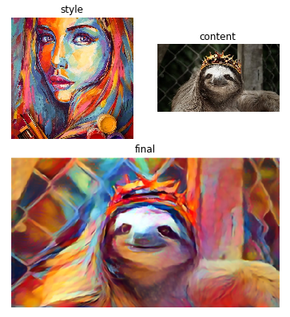
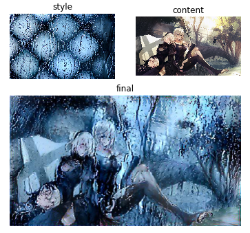
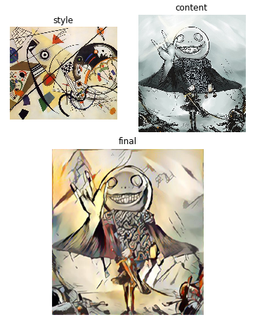
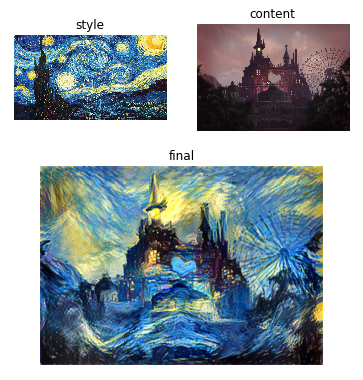

# Neural art

Transfers artistic style from one image to another. Uses the 19 layer convolutional neural network model [VGG-19](https://arxiv.org/abs/1409.1556). Forked from [MXNet Neural art](https://github.com/apache/incubator-mxnet/tree/master/example/neural-style).

This is an implementation of the paper
[A Neural Algorithm of Artistic Style](http://arxiv.org/abs/1508.06576) by Leon
A. Gatys, Alexander S. Ecker, and Matthias Bethge.

## How to use

~~First use `download.sh` to download pre-trained model and sample inputs~~

~~Then run `python nstyle.py`, use `-h` to see more options~~

Install MXNet and its requirements, then run with `jupyter notebook` and open neuralart.ipynb.

## Example results

___

&nbsp;
